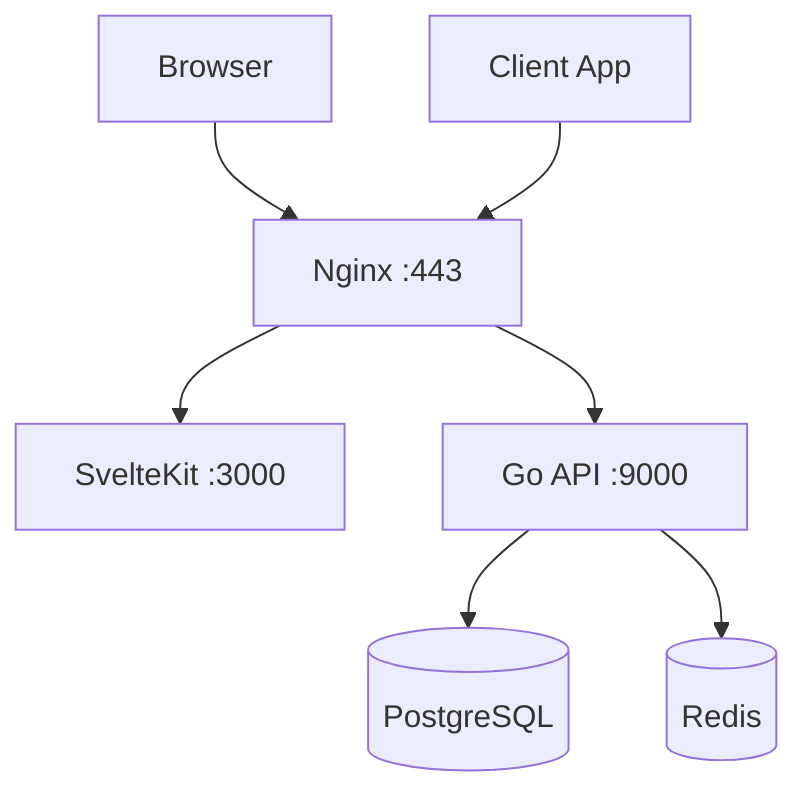

# OryxID

Modern OAuth 2.1 / OpenID Connect Authorization Server.

## Features

- OAuth 2.1 compliant (no implicit grant, PKCE required)
- OpenID Connect 1.0 Core
- MFA/2FA with TOTP and backup codes
- Multiple grant types: Authorization Code, Client Credentials, Device Authorization, Token Exchange, CIBA
- DPoP - Demonstrating Proof of Possession (RFC 9449)
- Rich Authorization Requests (RFC 9396)
- Pushed Authorization Requests (RFC 9126)
- Token Introspection and Revocation
- Multi-tenancy with tenant isolation
- Hierarchical scope expansion (admin includes write, write includes read)

See [Feature Documentation](docs/features.md) for detailed explanations and usage examples.

## Architecture



## Quick Start

```bash
# 1. Initial setup (generates secure passwords)
make setup

# 2. Install mkcert for trusted local SSL (recommended)
brew install mkcert    # macOS
# or: sudo apt install mkcert  # Linux

# 3. Generate trusted SSL certificates
make ssl-mkcert

# 4. Start all services
make up

# 5. Check health
make status
```

Access: https://localhost:8443

Admin credentials are displayed after `make setup`. To view them again:
```bash
grep "ADMIN_" .env
```

## Documentation

| Document | Description |
|----------|-------------|
| [Features](docs/features.md) | Detailed feature documentation with examples |
| [M2M Integration](docs/m2m-integration.md) | Machine-to-machine authentication guide |
| [Backend API](backend/README.md) | API endpoints, configuration, database schema |
| [Backend Testing](backend/TESTING.md) | Unit, integration, and security tests |
| [Frontend](frontend/README.md) | Admin UI development |
| [Helm Chart](helm/oryxid/README.md) | Kubernetes deployment |

## Project Structure

```text
.
├── backend/          # Go API server
├── frontend/         # SvelteKit admin UI
├── helm/             # Kubernetes Helm chart
├── docker/           # Docker configurations
├── certs/            # JWT and SSL certificates
├── scripts/          # Utility scripts
├── docs/             # Documentation
└── Makefile          # Development commands
```

## Make Commands

| Command | Description |
|---------|-------------|
| `make setup` | Initial setup (env, keys, SSL, secure passwords) |
| `make ssl-mkcert` | Generate trusted SSL certificates (recommended) |
| `make ssl` | Generate self-signed SSL (requires -k with curl) |
| `make up` / `make down` | Start/stop services |
| `make restart` | Restart services |
| `make build` | Build Docker images |
| `make status` | Health check all services |
| `make logs` | View container logs |
| `make test` | Run all tests |
| `make cert-init` | Get Let's Encrypt certificate |
| `make helm-install` | Deploy to Kubernetes |

Full list: `make help`

## OAuth Endpoints

| Endpoint | Description |
|----------|-------------|
| `/oauth/authorize` | Authorization endpoint |
| `/oauth/token` | Token endpoint |
| `/oauth/introspect` | Token introspection (RFC 7662) |
| `/oauth/revoke` | Token revocation (RFC 7009) |
| `/oauth/par` | Pushed Authorization Request (RFC 9126) |
| `/oauth/device_authorization` | Device flow (RFC 8628) |
| `/oauth/bc-authorize` | CIBA initiation |
| `/oauth/userinfo` | OpenID Connect UserInfo |
| `/.well-known/openid-configuration` | OIDC Discovery |
| `/.well-known/jwks.json` | JSON Web Key Set |

## Configuration

Environment variables (prefix: `ORYXID_`):

| Variable | Description | Default |
|----------|-------------|---------|
| `SERVER_PORT` | API server port | 9000 |
| `SERVER_MODE` | debug / release | debug |
| `DATABASE_HOST` | PostgreSQL host | localhost |
| `REDIS_HOST` | Redis host | localhost |
| `OAUTH_ISSUER` | Token issuer URL | http://localhost:9000 |
| `JWT_PRIVATEKEYPATH` | RSA private key | certs/private_key.pem |

Full configuration: see `.env.example`

## Security

- Secure random passwords generated during setup
- PKCE required for authorization code flow (S256 only)
- DPoP for sender-constrained tokens (RFC 9449)
- Refresh token rotation with reuse detection
- CSRF protection with SameSite cookies
- Rate limiting (configurable)
- TLS 1.2+ with modern cipher suites
- MFA with TOTP (RFC 6238)
- Tenant isolation for multi-tenancy

## CI/CD

GitHub Actions workflow (`.github/workflows/ci.yaml`):

| Trigger | Actions |
|---------|---------|
| Push/PR to main | Run tests, security audit (govulncheck, npm audit) |
| Push tag `v*` | Build and push images to ghcr.io |

## Deployment

### Docker Compose (Development)

```bash
make setup
make ssl-mkcert   # For trusted local SSL
make up
```

### Docker Compose (Production Images)

Use pre-built images from GitHub Container Registry:

```bash
cp .env.example .env
# Edit .env with production values
docker compose -f docker-compose.prod.yaml up -d
```

Images:
- `ghcr.io/<owner>/oryxid-backend:latest`
- `ghcr.io/<owner>/oryxid-frontend:latest`
- `ghcr.io/<owner>/oryxid-nginx:latest`

### Kubernetes

```bash
make helm-install --set ingress.hosts[0].host=auth.example.com
```

See [Helm Chart documentation](helm/oryxid/README.md).

## License

MIT
