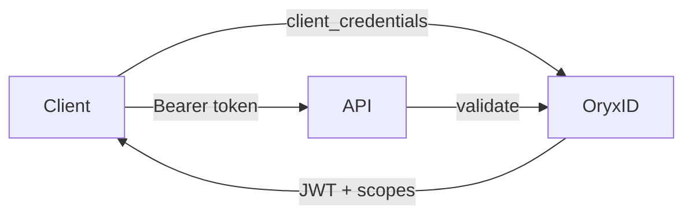
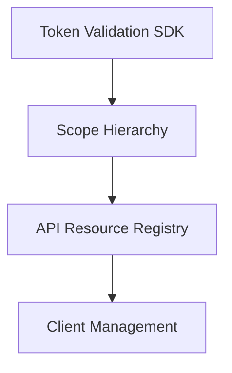
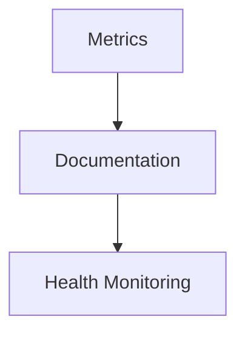
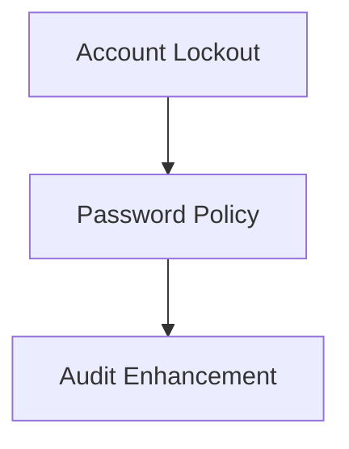
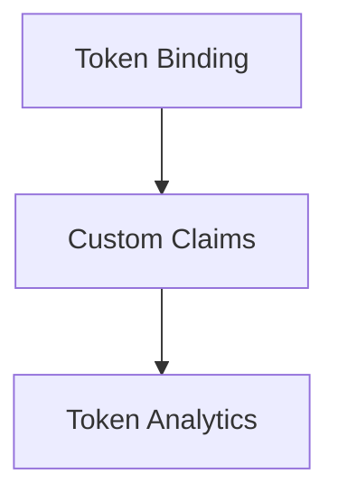
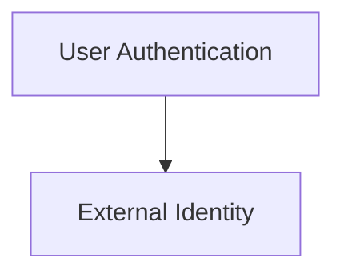

# OryxID Roadmap

## Mission

Lightweight OAuth 2.1 authorization server for securing internal APIs with scope-based access control.

---

## Phase 1: API Security Foundation

Core features for securing APIs with tokens and scopes.

### Token Validation SDK

- [x] Go middleware package for API servers
- [x] JWT validation with JWKS caching
- [x] Token introspection client
- [x] Scope enforcement helpers
- [x] Example integration code

### Scope Hierarchy

- [x] Wildcard scopes (billing:* grants billing:read, billing:write)
- [x] Scope inheritance model
- [x] Scope validation with hierarchy

### API Resource Registry

- [ ] Register API resources in admin
- [ ] Map scopes to API resources
- [ ] Resource-based token audience

### Client Management

- [ ] Client credentials rotation
- [ ] Client scope restrictions
- [x] Client rate limiting
- [x] Client activity logs

---

## Phase 2: Operational Readiness

Production operations and observability.

### Metrics

- [ ] Token issuance counter (by client, grant type)
- [ ] Token validation latency
- [ ] Failed authentication counter
- [ ] Rate limit violations
- [ ] Active tokens gauge

### Documentation

- [ ] M2M integration guide
- [ ] API security patterns
- [ ] Scope design guidelines
- [ ] OpenAPI specification

### Health Monitoring

- [ ] Detailed health endpoints
- [ ] Dependency health (database, redis)
- [ ] Alerting integration

---

## Phase 3: Admin Security

Secure the admin interface and operators.

### Account Lockout

- [ ] Lockout after failed attempts
- [ ] Configurable threshold
- [ ] Admin unlock capability

### Password Policy

- [ ] Minimum length (12+)
- [ ] Complexity requirements
- [ ] Password expiration

### Audit Enhancement

- [ ] Client credential usage logs
- [ ] Scope grant audit trail
- [ ] Admin action logs

---

## Phase 4: Advanced Token Features

Enhanced token capabilities.

### Token Binding

- [ ] DPoP (Demonstrating Proof of Possession)
- [ ] Client certificate binding

### Custom Claims

- [ ] Custom claim configuration per client
- [ ] Claim transformations
- [ ] External claim sources

### Token Analytics

- [ ] Token usage dashboard
- [ ] Client activity reports
- [ ] Scope usage statistics

---

## Phase 5: Extended Use Cases

Additional flows when needed.

### User Authentication

- [ ] Authorization Code flow improvements
- [ ] Session management
- [ ] User consent UI

### External Identity

- [ ] LDAP connector
- [ ] OIDC federation
- [ ] Social login

---

## Out of Scope

Not needed for M2M API security:

- Self-registration
- Password reset flow
- Email integration
- WebAuthn/Passkeys
- Multi-tenancy

---

## Completed

### OAuth 2.1 Core

- [x] Authorization Code with PKCE
- [x] Client Credentials
- [x] Refresh Token with rotation
- [x] Token Introspection (RFC 7662)
- [x] Token Revocation (RFC 7009)

### Token Infrastructure

- [x] OIDC Discovery endpoint
- [x] JWKS endpoint
- [x] JWT signing (RS256)
- [x] Configurable token expiry

### Scope and Audience

- [x] Scope CRUD in admin
- [x] Audience CRUD in admin
- [x] Scope validation on token request
- [x] Audience in token claims

### Security

- [x] PKCE enforcement (S256)
- [x] Client secret hashing
- [x] Rate limiting
- [x] CSRF protection
- [x] Security headers
- [x] TLS support

### Admin

- [x] Admin dashboard
- [x] Application management
- [x] User management
- [x] Scope management
- [x] Audience management
- [x] Audit logging

### Infrastructure

- [x] Docker support
- [x] Kubernetes Helm chart
- [x] PostgreSQL support
- [x] Redis integration
- [x] Health endpoint

### CI/CD

- [x] GitHub Actions workflow
- [x] go fmt check
- [x] go vet static analysis
- [x] go build verification
- [x] go test with race detection
- [x] govulncheck CVE scanning
- [x] npm audit for frontend

### SDK

- [x] Token validation SDK (backend/pkg/sdk)
- [x] JWKS caching with configurable TTL
- [x] Wildcard scope matching
- [x] Gin middleware
- [x] Standard http middleware
- [x] Unit tests
