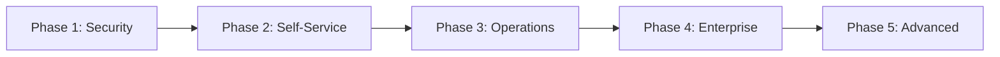
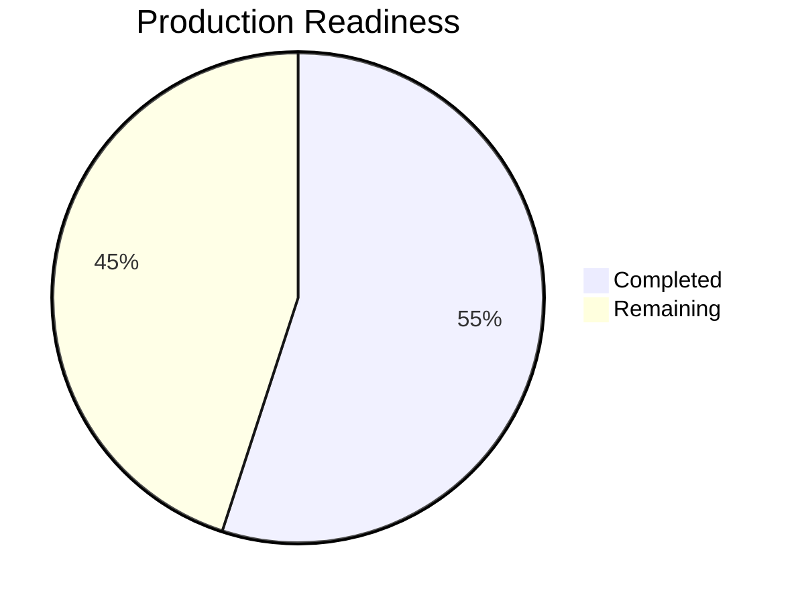
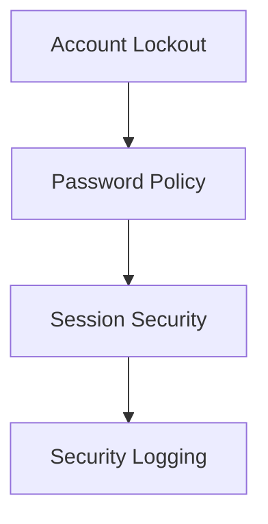
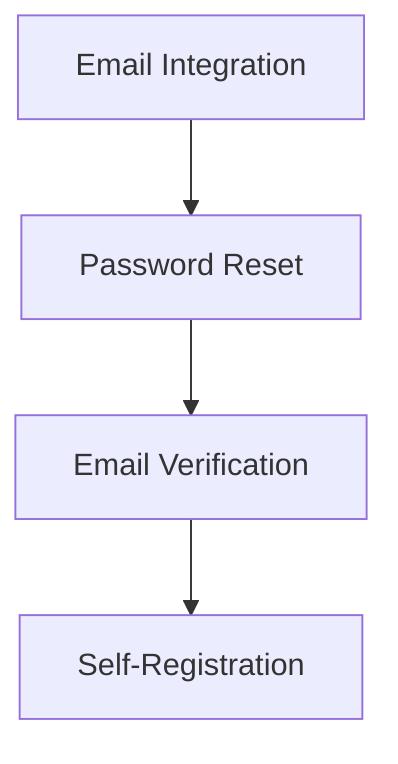
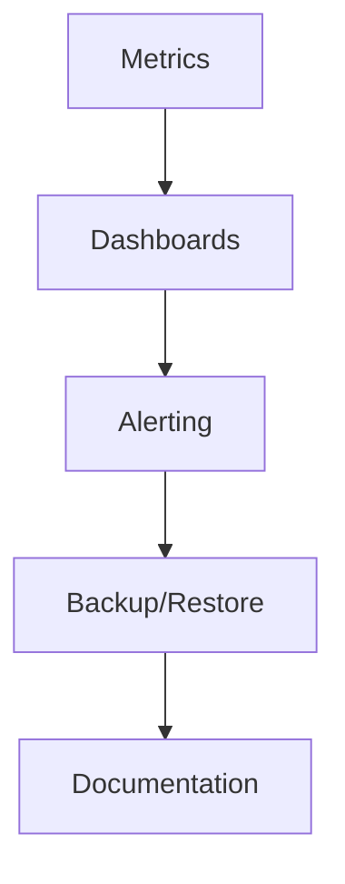
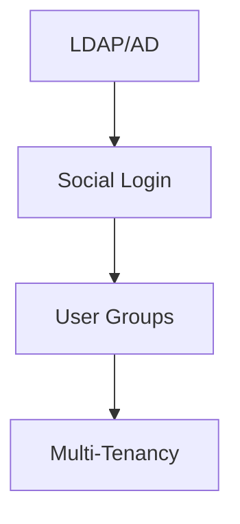
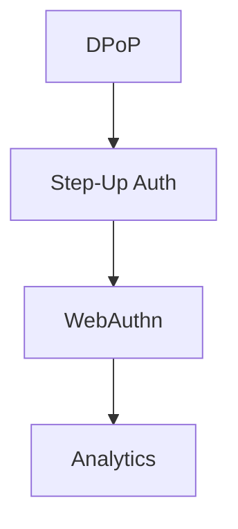

# OryxID Roadmap

## Overview

## Current Status

---

## Phase 1: Security Hardening

Critical security features required before production deployment.

### Account Protection

- [ ] Account lockout after failed login attempts
- [ ] Configurable lockout threshold and duration
- [ ] Exponential backoff on repeated failures
- [ ] Admin unlock capability

### Password Policy

- [ ] Minimum length configuration (default: 12)
- [ ] Complexity requirements (uppercase, lowercase, number, special)
- [ ] Password history prevention
- [ ] Password expiration policy
- [ ] Force password change on first login

### Session Security

- [ ] Maximum concurrent sessions per user
- [ ] Session timeout on inactivity
- [ ] Revoke all sessions on password change
- [ ] Token binding to IP/fingerprint (optional)

### Security Events

- [ ] Failed login attempt logging with alerts
- [ ] Suspicious activity detection
- [ ] Security event webhook notifications

---

## Phase 2: User Self-Service

Enable users to manage their own accounts.

### Email Integration

- [ ] Email provider abstraction (SMTP, SendGrid, AWS SES)
- [ ] Email templates (HTML + plaintext)
- [ ] Email queue with retry logic

### Password Reset

- [ ] Forgot password endpoint
- [ ] Secure reset token generation
- [ ] Reset token expiration
- [ ] Reset confirmation email

### Email Verification

- [ ] Verification email on registration
- [ ] Resend verification endpoint
- [ ] Enforce verified email for login (configurable)

### Self-Registration

- [ ] Public registration endpoint (configurable)
- [ ] CAPTCHA integration
- [ ] Registration approval workflow (optional)

---

## Phase 3: Operations

Production observability and operational tooling.

### Prometheus Metrics

- [ ] HTTP request latency histograms
- [ ] OAuth flow counters (by grant type)
- [ ] Token issuance rates
- [ ] Failed authentication counter
- [ ] Active sessions gauge
- [ ] Rate limit violation counter
- [ ] Database connection pool stats
- [ ] Redis connection pool stats

### Dashboards

- [ ] Grafana dashboard templates
- [ ] Authentication overview
- [ ] OAuth flow analytics
- [ ] Error rate monitoring
- [ ] Resource utilization

### Alerting

- [ ] High error rate alerts
- [ ] Failed login spike detection
- [ ] Database connection exhaustion
- [ ] Certificate expiration warning

### Backup and Recovery

- [ ] Automated database backup script
- [ ] Point-in-time recovery documentation
- [ ] Backup verification procedure
- [ ] Disaster recovery runbook

### Documentation

- [ ] OpenAPI/Swagger specification
- [ ] Deployment runbook
- [ ] Upgrade procedures
- [ ] Rollback procedures
- [ ] Troubleshooting guide
- [ ] Security hardening guide

---

## Phase 4: Enterprise Features

Features required for enterprise adoption.

### Directory Integration

- [ ] LDAP connector
- [ ] Active Directory support
- [ ] User sync scheduling
- [ ] Group mapping to roles

### Social Login

- [ ] OAuth provider abstraction
- [ ] Google connector
- [ ] GitHub connector
- [ ] Microsoft connector
- [ ] Custom provider support

### User Groups

- [ ] Group management API
- [ ] Group-based role assignment
- [ ] Nested groups support

### Multi-Tenancy

- [ ] Tenant/organization model
- [ ] Tenant isolation
- [ ] Per-tenant configuration
- [ ] Tenant admin delegation

---

## Phase 5: Advanced Features

Extended functionality for specialized use cases.

### Token Security

- [ ] DPoP (Demonstrating Proof of Possession)
- [ ] Sender-constrained tokens

### Adaptive Authentication

- [ ] Step-up authentication
- [ ] Risk-based authentication
- [ ] Geolocation policies

### Passwordless

- [ ] WebAuthn/FIDO2 support
- [ ] Passkey registration
- [ ] Passkey authentication

### Analytics

- [ ] Login analytics dashboard
- [ ] User activity reports
- [ ] OAuth client usage statistics
- [ ] Export capabilities

---

## Completed

### OAuth 2.1 Core

- [x] Authorization Code with PKCE (S256)
- [x] Client Credentials
- [x] Refresh Token with rotation
- [x] Token Introspection (RFC 7662)
- [x] Token Revocation (RFC 7009)
- [x] OIDC Discovery
- [x] JWKS endpoint

### Advanced OAuth

- [x] Device Authorization (RFC 8628)
- [x] Token Exchange (RFC 8693)
- [x] Pushed Authorization Requests (RFC 9126)
- [x] Rich Authorization Requests (RFC 9396)
- [x] CIBA (OpenID Connect Backchannel Authentication)

### Security

- [x] MFA/2FA with TOTP
- [x] Backup codes
- [x] CSRF protection
- [x] Rate limiting
- [x] Security headers
- [x] TLS 1.2+ support
- [x] Let's Encrypt integration

### Infrastructure

- [x] Docker support
- [x] Docker Compose (dev + prod)
- [x] Kubernetes Helm chart
- [x] PostgreSQL support
- [x] Redis integration
- [x] Nginx reverse proxy

### Admin

- [x] Admin dashboard
- [x] User management
- [x] Application management
- [x] Scope management
- [x] Audience management
- [x] Audit logging
