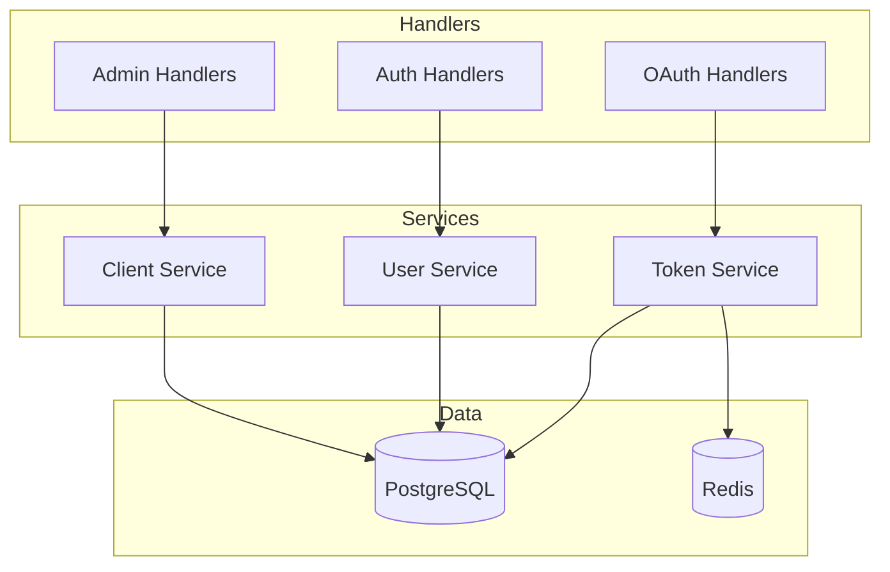
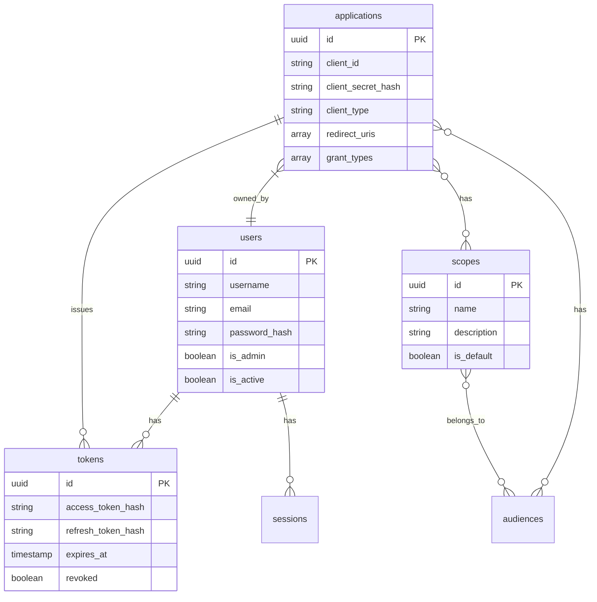

# OryxID Backend

Go-based OAuth2/OIDC server using Gin framework.

For project overview, see [main README](../README.md).

## Structure



## OAuth Endpoints

| Endpoint | Method | Description |
|----------|--------|-------------|
| `/oauth/authorize` | GET | Authorization request |
| `/oauth/token` | POST | Token exchange |
| `/oauth/revoke` | POST | Token revocation |
| `/oauth/introspect` | POST | Token introspection |
| `/oauth/par` | POST | Pushed Authorization Request |
| `/oauth/userinfo` | GET | UserInfo endpoint |

## Discovery Endpoints

| Endpoint | Description |
|----------|-------------|
| `/.well-known/openid-configuration` | OIDC Discovery |
| `/.well-known/jwks.json` | JSON Web Key Set |

## Admin API

All admin endpoints require authentication.

### Applications

```
GET    /api/admin/applications          List applications
POST   /api/admin/applications          Create application
GET    /api/admin/applications/:id      Get application
PUT    /api/admin/applications/:id      Update application
DELETE /api/admin/applications/:id      Delete application
```

### Users

```
GET    /api/admin/users                 List users
POST   /api/admin/users                 Create user
GET    /api/admin/users/:id             Get user
PUT    /api/admin/users/:id             Update user
DELETE /api/admin/users/:id             Delete user
```

### Scopes

```
GET    /api/admin/scopes                List scopes
POST   /api/admin/scopes                Create scope
GET    /api/admin/scopes/:id            Get scope
PUT    /api/admin/scopes/:id            Update scope
DELETE /api/admin/scopes/:id            Delete scope
```

### Audit Logs

```
GET    /api/admin/audit-logs            List audit logs
```

### Key Management

```
GET    /api/admin/keys                  List signing keys
POST   /api/admin/keys/rotate           Rotate signing key
POST   /api/admin/keys/:kid/revoke      Revoke key
POST   /api/admin/keys/:kid/deactivate  Deactivate key
POST   /api/admin/keys/:kid/activate    Activate key
POST   /api/admin/keys/cleanup          Cleanup expired keys
```

## Development

### Prerequisites

- Go 1.21+
- PostgreSQL 16+
- Redis 7+

### Local Development

```bash
# Start dependencies
docker compose up -d postgres redis

# Run server
go run cmd/server/main.go

# Or use make
make dev-backend
```

### Configuration

Environment variables with `ORYXID_` prefix:

| Variable | Description |
|----------|-------------|
| `ORYXID_SERVER_PORT` | Server port (default: 9000) |
| `ORYXID_SERVER_MODE` | debug/release |
| `ORYXID_DATABASE_HOST` | PostgreSQL host |
| `ORYXID_DATABASE_PORT` | PostgreSQL port |
| `ORYXID_DATABASE_USER` | Database user |
| `ORYXID_DATABASE_PASSWORD` | Database password |
| `ORYXID_DATABASE_NAME` | Database name |
| `ORYXID_REDIS_HOST` | Redis host |
| `ORYXID_REDIS_PORT` | Redis port |
| `ORYXID_REDIS_PASSWORD` | Redis password |
| `ORYXID_JWT_PRIVATEKEYPATH` | RSA private key path |
| `ORYXID_JWT_PUBLICKEYPATH` | RSA public key path |
| `ORYXID_OAUTH_ISSUER` | Token issuer URL |
| `ORYXID_OAUTH_ACCESSTOKENLIFESPAN` | Access token TTL (seconds) |
| `ORYXID_OAUTH_REFRESHTOKENLIFESPAN` | Refresh token TTL (seconds) |

## Testing

```bash
# All tests
go test -v ./...

# Specific package
go test -v ./internal/handlers/...
go test -v ./internal/oauth/...

# With coverage
go test -coverprofile=coverage.out ./...
go tool cover -html=coverage.out

# Race detection
go test -race ./...

# Benchmarks
go test -bench=. ./...
```

### Test Categories

| Directory | Description |
|-----------|-------------|
| `internal/handlers/*_test.go` | Handler unit tests |
| `internal/middleware/*_test.go` | Middleware tests |
| `internal/tokens/*_test.go` | Token manager tests |
| `internal/database/*_test.go` | Database model tests |
| `tests/integration/` | Integration tests |
| `tests/security/` | Security tests |

### Integration Tests

Require running services:

```bash
# Start services
make up

# Run integration tests
go test -v ./tests/integration/...
```

## API Examples

### Client Credentials Flow

```bash
curl -X POST http://localhost:9000/oauth/token \
  -d "grant_type=client_credentials" \
  -d "client_id=YOUR_CLIENT_ID" \
  -d "client_secret=YOUR_SECRET" \
  -d "scope=read write"
```

### Authorization Code Flow (with PKCE)

```bash
# 1. Generate PKCE
code_verifier=$(openssl rand -base64 32 | tr -d '=/+')
code_challenge=$(echo -n $code_verifier | openssl dgst -sha256 -binary | base64 | tr -d '=/+' | tr '+/' '-_')

# 2. Authorize
# Redirect user to:
# /oauth/authorize?response_type=code&client_id=X&redirect_uri=Y&code_challenge=Z&code_challenge_method=S256

# 3. Exchange code
curl -X POST http://localhost:9000/oauth/token \
  -d "grant_type=authorization_code" \
  -d "code=AUTH_CODE" \
  -d "redirect_uri=YOUR_REDIRECT_URI" \
  -d "client_id=YOUR_CLIENT_ID" \
  -d "code_verifier=$code_verifier"
```

### Token Introspection

```bash
curl -X POST http://localhost:9000/oauth/introspect \
  -u "client_id:client_secret" \
  -d "token=ACCESS_TOKEN"
```

### Token Revocation

```bash
curl -X POST http://localhost:9000/oauth/revoke \
  -u "client_id:client_secret" \
  -d "token=REFRESH_TOKEN"
```

## Database Schema



## Middleware

| Middleware | Description |
|------------|-------------|
| CORS | Cross-origin resource sharing |
| CSRF | Token-based CSRF protection |
| Rate Limit | Request rate limiting |
| Security Headers | HSTS, CSP, X-Frame-Options |
| Request ID | Unique request tracking |
| Logger | Request/response logging |

## Health Endpoints

| Endpoint | Description |
|----------|-------------|
| `/health` | Liveness check |
| `/ready` | Readiness check (includes DB) |
| `/metrics` | Prometheus metrics |
