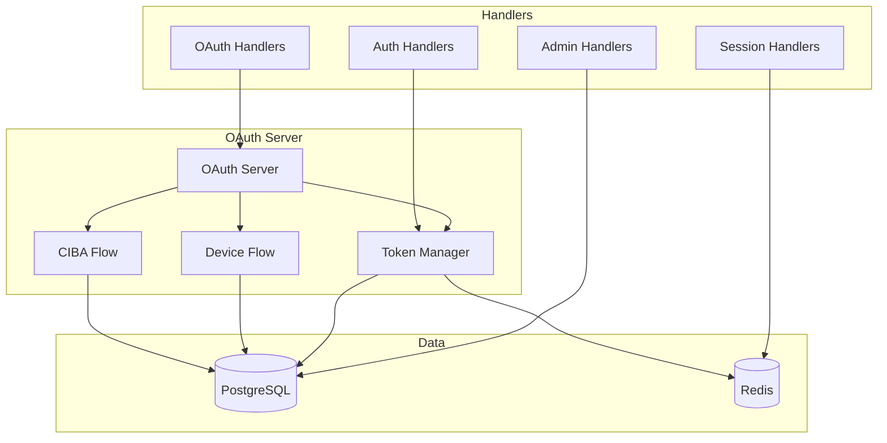
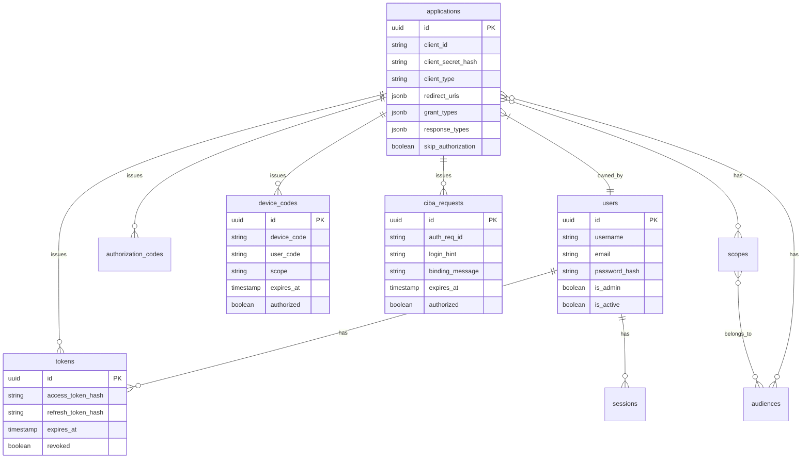

# OryxID Backend

Go-based OAuth2/OIDC server using Gin framework with comprehensive protocol support.

For project overview, see [main README](../README.md).

## Structure



## OAuth Endpoints

### Core OAuth 2.0 / OIDC

| Endpoint | Method | Description | RFC |
|----------|--------|-------------|-----|
| `/oauth/authorize` | GET/POST | Authorization endpoint | RFC 6749 |
| `/oauth/token` | POST | Token endpoint | RFC 6749 |
| `/oauth/revoke` | POST | Token revocation | RFC 7009 |
| `/oauth/introspect` | POST | Token introspection | RFC 7662 |
| `/oauth/userinfo` | GET/POST | UserInfo endpoint | OIDC Core |

### Advanced Flows

| Endpoint | Method | Description | RFC |
|----------|--------|-------------|-----|
| `/oauth/par` | POST | Pushed Authorization Request | RFC 9126 |
| `/oauth/device_authorization` | POST | Device authorization | RFC 8628 |
| `/oauth/device` | GET | Device verification page | RFC 8628 |
| `/oauth/device` | POST | Device authorization (user) | RFC 8628 |
| `/oauth/bc-authorize` | POST | CIBA initiation | OIDC CIBA |

### Token Endpoint Grant Types

| Grant Type | Description | RFC |
|------------|-------------|-----|
| `authorization_code` | Authorization code flow | RFC 6749 |
| `client_credentials` | Machine-to-machine | RFC 6749 |
| `refresh_token` | Token refresh | RFC 6749 |
| `urn:ietf:params:oauth:grant-type:device_code` | Device flow | RFC 8628 |
| `urn:ietf:params:oauth:grant-type:token-exchange` | Token exchange | RFC 8693 |
| `urn:openid:params:grant-type:ciba` | CIBA polling | OIDC CIBA |

## Discovery Endpoints

| Endpoint | Description |
|----------|-------------|
| `/.well-known/openid-configuration` | OIDC Discovery |
| `/.well-known/jwks.json` | JSON Web Key Set |

## Admin API

All admin endpoints require authentication via Bearer token. Base path: `/api/v1`

### Applications

```
GET    /api/v1/applications          List applications
POST   /api/v1/applications          Create application
GET    /api/v1/applications/:id      Get application
PUT    /api/v1/applications/:id      Update application
DELETE /api/v1/applications/:id      Delete application
```

### Users (Admin Only)

```
GET    /api/v1/users                 List users
POST   /api/v1/users                 Create user
GET    /api/v1/users/:id             Get user
PUT    /api/v1/users/:id             Update user
DELETE /api/v1/users/:id             Delete user
```

### Scopes

```
GET    /api/v1/scopes                List scopes
POST   /api/v1/scopes                Create scope
GET    /api/v1/scopes/:id            Get scope
PUT    /api/v1/scopes/:id            Update scope
DELETE /api/v1/scopes/:id            Delete scope
```

### Audiences

```
GET    /api/v1/audiences             List audiences
POST   /api/v1/audiences             Create audience
GET    /api/v1/audiences/:id         Get audience
PUT    /api/v1/audiences/:id         Update audience
DELETE /api/v1/audiences/:id         Delete audience
```

### Audit Logs (Admin Only)

```
GET    /api/v1/audit-logs            List audit logs
```

### Statistics

```
GET    /api/v1/stats                 Get dashboard statistics
```

## Authentication Endpoints

| Endpoint | Method | Description |
|----------|--------|-------------|
| `/auth/login` | POST | Admin login |
| `/auth/logout` | POST | Logout (requires auth) |
| `/auth/me` | GET | Current user info |
| `/auth/refresh` | POST | Refresh JWT token |

## Session Management

Requires Redis. All endpoints require authentication.

| Endpoint | Method | Description |
|----------|--------|-------------|
| `/sessions` | GET | List active sessions |
| `/sessions/:id` | DELETE | Revoke specific session |
| `/sessions` | DELETE | Revoke all sessions |

## Development

### Prerequisites

- Go 1.21+
- PostgreSQL 16+
- Redis 7+ (optional, for sessions)

### Local Development

```bash
# Start dependencies
docker compose up -d postgres redis

# Run server
go run cmd/server/main.go

# Or use make
make dev-backend
```

### Configuration

Environment variables with `ORYXID_` prefix:

| Variable | Description | Default |
|----------|-------------|---------|
| `ORYXID_SERVER_PORT` | Server port | 9000 |
| `ORYXID_SERVER_MODE` | debug/release | debug |
| `ORYXID_DATABASE_HOST` | PostgreSQL host | localhost |
| `ORYXID_DATABASE_PORT` | PostgreSQL port | 5432 |
| `ORYXID_DATABASE_USER` | Database user | oryxid |
| `ORYXID_DATABASE_PASSWORD` | Database password | - |
| `ORYXID_DATABASE_NAME` | Database name | oryxid |
| `ORYXID_REDIS_HOST` | Redis host | - |
| `ORYXID_REDIS_PORT` | Redis port | 6379 |
| `ORYXID_JWT_PRIVATEKEYPATH` | RSA private key path | certs/private_key.pem |
| `ORYXID_OAUTH_ISSUER` | Token issuer URL | http://localhost:8080 |
| `ORYXID_OAUTH_ACCESSTOKENLIFESPAN` | Access token TTL | 3600 |
| `ORYXID_OAUTH_REFRESHTOKENLIFESPAN` | Refresh token TTL | 2592000 |

## Testing

```bash
# All tests
go test -v ./...

# Specific package
go test -v ./internal/handlers/...
go test -v ./internal/oauth/...

# With coverage
go test -coverprofile=coverage.out ./...
go tool cover -html=coverage.out

# Race detection
go test -race ./...

# Benchmarks
go test -bench=. ./...
```

### Test Categories

| Directory | Description |
|-----------|-------------|
| `internal/handlers/*_test.go` | Handler unit tests |
| `internal/middleware/*_test.go` | Middleware tests |
| `internal/tokens/*_test.go` | Token manager tests |
| `internal/database/*_test.go` | Database model tests |
| `internal/oauth/*_test.go` | OAuth server tests |
| `tests/integration/` | Integration tests |
| `tests/security/` | Security tests |

### Integration Tests

Require running services:

```bash
# Start services
make up

# Run integration tests with environment variables
TEST_CLIENT_ID=your-client-id \
TEST_CLIENT_SECRET=your-secret \
API_URL=http://localhost:9000 \
go test -v ./tests/integration/...
```

See [TESTING.md](./TESTING.md) for detailed testing guide.

## API Examples

### Client Credentials Flow

```bash
curl -X POST http://localhost:9000/oauth/token \
  -u "client_id:client_secret" \
  -d "grant_type=client_credentials" \
  -d "scope=read write"
```

### Authorization Code Flow (with PKCE)

```bash
# 1. Generate PKCE
code_verifier=$(openssl rand -base64 32 | tr -d '=/+')
code_challenge=$(echo -n $code_verifier | openssl dgst -sha256 -binary | base64 | tr -d '=/+' | tr '+/' '-_')

# 2. Authorize (redirect user to):
# /oauth/authorize?response_type=code&client_id=X&redirect_uri=Y&code_challenge=Z&code_challenge_method=S256

# 3. Exchange code
curl -X POST http://localhost:9000/oauth/token \
  -d "grant_type=authorization_code" \
  -d "code=AUTH_CODE" \
  -d "redirect_uri=YOUR_REDIRECT_URI" \
  -d "client_id=YOUR_CLIENT_ID" \
  -d "code_verifier=$code_verifier"
```

### Device Authorization Flow (RFC 8628)

```bash
# 1. Request device code
curl -X POST http://localhost:9000/oauth/device_authorization \
  -d "client_id=YOUR_CLIENT_ID" \
  -d "scope=openid profile"

# Response: device_code, user_code, verification_uri

# 2. Poll for token (while user authorizes)
curl -X POST http://localhost:9000/oauth/token \
  -d "grant_type=urn:ietf:params:oauth:grant-type:device_code" \
  -d "device_code=DEVICE_CODE" \
  -d "client_id=YOUR_CLIENT_ID"
```

### Token Exchange (RFC 8693)

```bash
curl -X POST http://localhost:9000/oauth/token \
  -u "client_id:client_secret" \
  -d "grant_type=urn:ietf:params:oauth:grant-type:token-exchange" \
  -d "subject_token=EXISTING_TOKEN" \
  -d "subject_token_type=urn:ietf:params:oauth:token-type:access_token" \
  -d "audience=target-service"
```

### CIBA (Client-Initiated Backchannel Authentication)

```bash
# 1. Initiate backchannel authentication
curl -X POST http://localhost:9000/oauth/bc-authorize \
  -u "client_id:client_secret" \
  -d "login_hint=user@example.com" \
  -d "scope=openid" \
  -d "binding_message=Login request"

# Response: auth_req_id, expires_in, interval

# 2. Poll for token
curl -X POST http://localhost:9000/oauth/token \
  -u "client_id:client_secret" \
  -d "grant_type=urn:openid:params:grant-type:ciba" \
  -d "auth_req_id=AUTH_REQ_ID"
```

### Pushed Authorization Requests (RFC 9126)

```bash
# 1. Push authorization request
curl -X POST http://localhost:9000/oauth/par \
  -u "client_id:client_secret" \
  -d "response_type=code" \
  -d "redirect_uri=https://app.com/callback" \
  -d "scope=openid profile" \
  -d "code_challenge=..." \
  -d "code_challenge_method=S256"

# Response: request_uri, expires_in

# 2. Use request_uri in authorize
# /oauth/authorize?client_id=X&request_uri=urn:ietf:params:oauth:request_uri:...
```

### Token Introspection

```bash
curl -X POST http://localhost:9000/oauth/introspect \
  -u "client_id:client_secret" \
  -d "token=ACCESS_TOKEN"
```

### Token Revocation

```bash
curl -X POST http://localhost:9000/oauth/revoke \
  -u "client_id:client_secret" \
  -d "token=REFRESH_TOKEN"
```

## Database Schema



## Middleware

| Middleware | Description |
|------------|-------------|
| CORS | Cross-origin resource sharing |
| CSRF | Token-based CSRF protection |
| Rate Limit | Request rate limiting (Redis or in-memory) |
| Security Headers | HSTS, X-Frame-Options, X-Content-Type-Options |
| Request ID | Unique request tracking (X-Request-ID) |
| Logger | Structured request/response logging |
| Recovery | Panic recovery |

### CSRF Skip Paths

The following paths are exempt from CSRF validation:

- `/health`, `/metrics` - Monitoring endpoints
- `/auth/login`, `/auth/logout`, `/auth/refresh` - Auth endpoints
- `/oauth/*` - OAuth endpoints (use client credentials)
- `/api/v1/*` - API endpoints (use Bearer tokens)
- `/.well-known/*` - Discovery endpoints

## Health Endpoints

| Endpoint | Description |
|----------|-------------|
| `/health` | Liveness check (includes database) |
| `/metrics` | Prometheus metrics |

## Background Tasks

The server runs periodic cleanup tasks:

| Task | Interval | Description |
|------|----------|-------------|
| Token cleanup | 1 hour | Remove expired tokens |
| Session cleanup | 30 min | Remove expired sessions |
| Auth code cleanup | 15 min | Remove expired authorization codes |
| Device code cleanup | 15 min | Remove expired device codes |
| CIBA request cleanup | 5 min | Remove expired CIBA requests |
