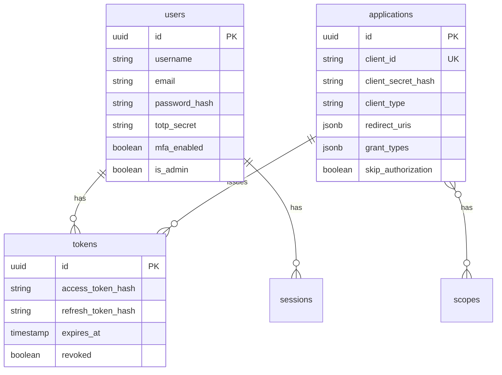

# Backend

Go API server for OryxID. See [main README](../README.md) for project overview.

## OAuth Endpoints

| Endpoint | Method | Description | RFC |
|----------|--------|-------------|-----|
| `/oauth/authorize` | GET | Authorization | RFC 6749 |
| `/oauth/token` | POST | Token | RFC 6749 |
| `/oauth/revoke` | POST | Revocation | RFC 7009 |
| `/oauth/introspect` | POST | Introspection | RFC 7662 |
| `/oauth/userinfo` | GET/POST | UserInfo | OIDC Core |
| `/oauth/par` | POST | PAR | RFC 9126 |
| `/oauth/device_authorization` | POST | Device flow | RFC 8628 |
| `/oauth/bc-authorize` | POST | CIBA | OIDC CIBA |

### Grant Types

| Grant Type | Description |
|------------|-------------|
| `authorization_code` | Authorization code with PKCE |
| `client_credentials` | Machine-to-machine |
| `refresh_token` | Token refresh with rotation |
| `urn:ietf:params:oauth:grant-type:device_code` | Device flow |
| `urn:ietf:params:oauth:grant-type:token-exchange` | Token exchange |
| `urn:openid:params:grant-type:ciba` | Backchannel auth |

## Admin API

Base path: `/api/v1`. Requires Bearer token authentication.

### Applications

```text
GET/POST   /api/v1/applications
GET/PUT/DELETE /api/v1/applications/:id
```

### Users

```text
GET/POST   /api/v1/users
GET/PUT/DELETE /api/v1/users/:id
```

### Scopes

```text
GET/POST   /api/v1/scopes
GET/PUT/DELETE /api/v1/scopes/:id
```

### Audiences

```text
GET/POST   /api/v1/audiences
GET/PUT/DELETE /api/v1/audiences/:id
```

### Other

```text
GET /api/v1/audit-logs    # Audit logs (admin only)
GET /api/v1/stats         # Dashboard statistics
```

## Auth Endpoints

| Endpoint | Method | Description |
|----------|--------|-------------|
| `/auth/login` | POST | Login, returns JWT |
| `/auth/logout` | POST | Logout (requires auth) |
| `/auth/me` | GET | Current user info |
| `/auth/refresh` | POST | Refresh JWT |
| `/auth/mfa/setup` | POST | Setup MFA |
| `/auth/mfa/verify` | POST | Verify MFA code |
| `/auth/mfa/disable` | POST | Disable MFA |
| `/auth/login/mfa` | POST | Complete MFA login |

## Discovery

| Endpoint | Description |
|----------|-------------|
| `/.well-known/openid-configuration` | OIDC Discovery |
| `/.well-known/jwks.json` | JSON Web Key Set |

## Development

### Prerequisites

- Go 1.21+
- PostgreSQL 16+
- Redis 7+

### Run Locally

```bash
# Start dependencies
docker compose up -d postgres redis

# Run server
go run cmd/server/main.go

# Or via make
make dev-backend
```

### Configuration

Environment variables (prefix: `ORYXID_`):

| Variable | Default |
|----------|---------|
| `SERVER_PORT` | 9000 |
| `SERVER_MODE` | debug |
| `DATABASE_HOST` | localhost |
| `DATABASE_PORT` | 5432 |
| `DATABASE_USER` | oryxid |
| `DATABASE_NAME` | oryxid |
| `REDIS_HOST` | localhost |
| `REDIS_PORT` | 6379 |
| `JWT_PRIVATEKEYPATH` | certs/private_key.pem |
| `OAUTH_ISSUER` | <http://localhost:8080> |
| `OAUTH_ACCESSTOKENLIFESPAN` | 3600s |
| `OAUTH_REFRESHTOKENLIFESPAN` | 2592000s |

## Testing

See [TESTING.md](./TESTING.md) for complete guide.

```bash
go test ./...                    # All tests
go test ./internal/handlers/...  # Handlers only
go test -race ./...              # Race detection
go test -cover ./...             # Coverage
```

## Database Schema



## API Examples

### Client Credentials

```bash
curl -X POST http://localhost:9000/oauth/token \
  -u "client_id:client_secret" \
  -d "grant_type=client_credentials&scope=read"
```

### Device Flow

```bash
# 1. Get device code
curl -X POST http://localhost:9000/oauth/device_authorization \
  -d "client_id=CLIENT_ID&scope=openid"

# 2. Poll for token
curl -X POST http://localhost:9000/oauth/token \
  -d "grant_type=urn:ietf:params:oauth:grant-type:device_code" \
  -d "device_code=DEVICE_CODE&client_id=CLIENT_ID"
```

### Token Exchange

```bash
curl -X POST http://localhost:9000/oauth/token \
  -u "client_id:client_secret" \
  -d "grant_type=urn:ietf:params:oauth:grant-type:token-exchange" \
  -d "subject_token=TOKEN" \
  -d "subject_token_type=urn:ietf:params:oauth:token-type:access_token"
```

### Introspection

```bash
curl -X POST http://localhost:9000/oauth/introspect \
  -u "client_id:client_secret" \
  -d "token=ACCESS_TOKEN"
```

## Health

| Endpoint | Description |
|----------|-------------|
| `/health` | Liveness (includes DB check) |
| `/metrics` | Prometheus metrics |
