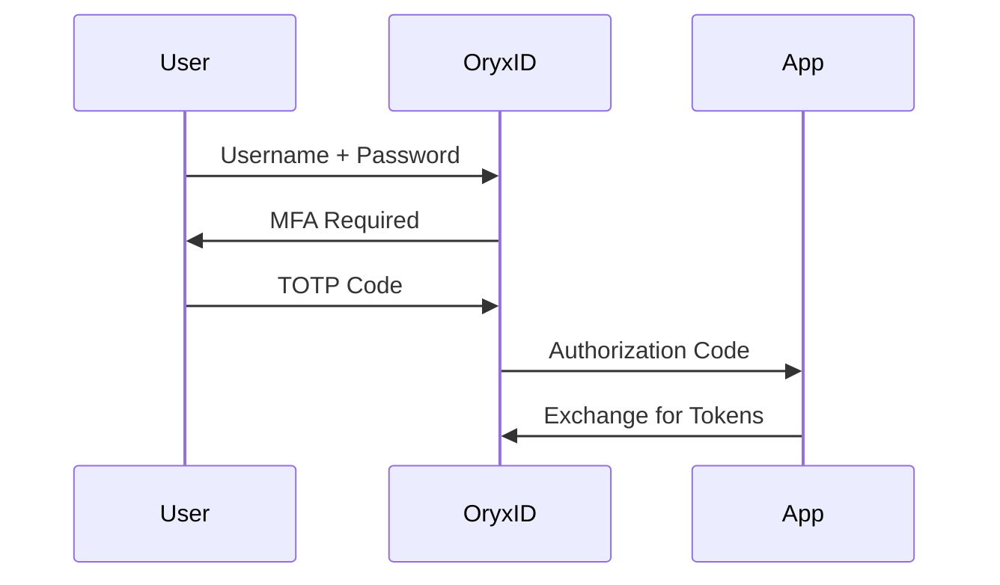
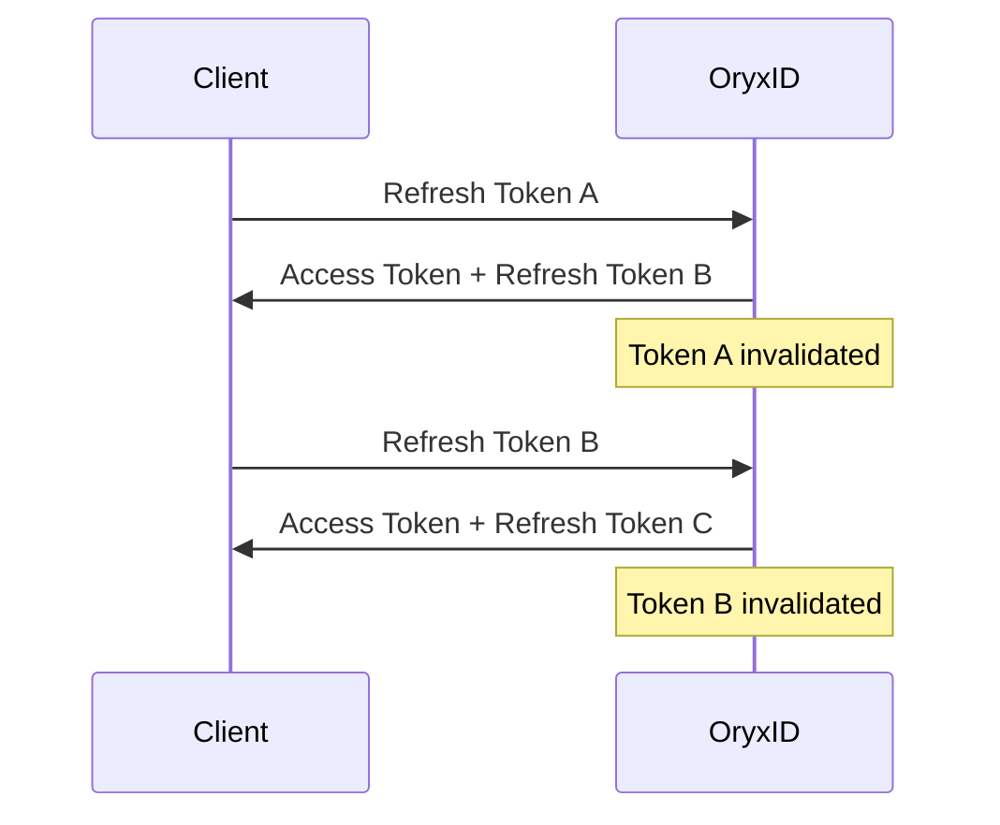

# OryxID Features

## OAuth 2.1 Compliance

OryxID implements OAuth 2.1 (draft-ietf-oauth-v2-1), which consolidates security best practices.

### Key Differences from OAuth 2.0

| Feature | OAuth 2.0 | OAuth 2.1 |
| --------- | ----------- | ----------- |
| Implicit Grant | Allowed | Removed |
| Password Grant | Allowed | Removed |
| PKCE | Optional | Required |
| Refresh Token Rotation | Optional | Required |
| Bearer Tokens in URI | Allowed | Prohibited |

### PKCE (Proof Key for Code Exchange)

All authorization code flows require PKCE with S256 method.

```bash
# Generate code verifier and challenge
CODE_VERIFIER=$(openssl rand -base64 32 | tr -d '=/+' | cut -c1-43)
CODE_CHALLENGE=$(echo -n $CODE_VERIFIER | openssl dgst -sha256 -binary | base64 | tr -d '=' | tr '/+' '_-')

# Authorization request
curl "${AUTH_ISSUER}/oauth/authorize?response_type=code&client_id=${CLIENT_ID}&code_challenge=${CODE_CHALLENGE}&code_challenge_method=S256&redirect_uri=${REDIRECT_URI}"

# Token request
curl -X POST ${AUTH_ISSUER}/oauth/token \
  -d "grant_type=authorization_code" \
  -d "code=${AUTH_CODE}" \
  -d "code_verifier=${CODE_VERIFIER}" \
  -d "client_id=${CLIENT_ID}" \
  -d "redirect_uri=${REDIRECT_URI}"
```

---

## OpenID Connect 1.0

OryxID is an OpenID Provider (OP) implementing OIDC Core 1.0.

### ID Token

When `openid` scope is requested, an ID Token (JWT) is issued containing identity claims.

```json
{
  "iss": "https://auth.example.com",
  "sub": "user-uuid",
  "aud": "client-id",
  "exp": 1704067200,
  "iat": 1704063600,
  "auth_time": 1704063500,
  "nonce": "abc123",
  "email": "user@example.com",
  "email_verified": true
}
```

### UserInfo Endpoint

```bash
curl ${AUTH_ISSUER}/oauth/userinfo \
  -H "Authorization: Bearer ${ACCESS_TOKEN}"
```

### Discovery

```bash
curl ${AUTH_ISSUER}/.well-known/openid-configuration
```

---

## MFA/2FA

Multi-factor authentication using TOTP (RFC 6238) and backup codes.

### TOTP Setup

1. User enables MFA in account settings
2. Server generates secret and QR code
3. User scans with authenticator app (Google Authenticator, Authy, etc.)
4. User enters verification code to confirm

### Backup Codes

- 10 single-use recovery codes generated during MFA setup
- Each code can only be used once
- Store securely offline

### Login Flow with MFA



---

## Grant Types

### Authorization Code

For web and mobile applications with user interaction.

```bash
# Step 1: Redirect to authorization
GET /oauth/authorize?response_type=code&client_id=xxx&redirect_uri=xxx&scope=openid&code_challenge=xxx&code_challenge_method=S256

# Step 2: Exchange code for tokens
POST /oauth/token
grant_type=authorization_code&code=xxx&code_verifier=xxx&redirect_uri=xxx
```

### Client Credentials

For machine-to-machine (M2M) communication without user context.

```bash
curl -X POST ${AUTH_ISSUER}/oauth/token \
  -u "${CLIENT_ID}:${CLIENT_SECRET}" \
  -d "grant_type=client_credentials" \
  -d "scope=api:read api:write"
```

### Device Authorization (RFC 8628)

For devices with limited input capability (smart TVs, CLI tools).

```bash
# Step 1: Request device code
curl -X POST ${AUTH_ISSUER}/oauth/device_authorization \
  -d "client_id=${CLIENT_ID}" \
  -d "scope=openid profile"

# Response
{
  "device_code": "xxx",
  "user_code": "ABCD-EFGH",
  "verification_uri": "https://auth.example.com/device",
  "expires_in": 1800,
  "interval": 5
}

# Step 2: User visits verification_uri and enters user_code

# Step 3: Poll for token
curl -X POST ${AUTH_ISSUER}/oauth/token \
  -d "grant_type=urn:ietf:params:oauth:grant-type:device_code" \
  -d "device_code=${DEVICE_CODE}" \
  -d "client_id=${CLIENT_ID}"
```

### Token Exchange (RFC 8693)

Exchange one token for another with different scope or audience.

```bash
curl -X POST ${AUTH_ISSUER}/oauth/token \
  -u "${CLIENT_ID}:${CLIENT_SECRET}" \
  -d "grant_type=urn:ietf:params:oauth:grant-type:token-exchange" \
  -d "subject_token=${ORIGINAL_TOKEN}" \
  -d "subject_token_type=urn:ietf:params:oauth:token-type:access_token" \
  -d "audience=target-service" \
  -d "scope=read"
```

### CIBA (Client-Initiated Backchannel Authentication)

Authenticate users on a separate device (call center, POS systems).

```bash
# Step 1: Initiate authentication
curl -X POST ${AUTH_ISSUER}/oauth/bc-authorize \
  -u "${CLIENT_ID}:${CLIENT_SECRET}" \
  -d "scope=openid" \
  -d "login_hint=user@example.com" \
  -d "binding_message=Confirm login to ExampleApp"

# Response
{
  "auth_req_id": "xxx",
  "expires_in": 120,
  "interval": 5
}

# Step 2: User receives push notification and approves

# Step 3: Poll for token
curl -X POST ${AUTH_ISSUER}/oauth/token \
  -u "${CLIENT_ID}:${CLIENT_SECRET}" \
  -d "grant_type=urn:openid:params:grant-type:ciba" \
  -d "auth_req_id=${AUTH_REQ_ID}"
```

---

## DPoP (RFC 9449)

Demonstrating Proof of Possession binds tokens to a client key pair, preventing token theft.

### How It Works

1. Client generates ephemeral key pair
2. Client creates DPoP proof JWT signed with private key
3. Server binds access token to public key
4. Each API request requires new DPoP proof

### Token Request

```bash
# DPoP proof header
{
  "typ": "dpop+jwt",
  "alg": "ES256",
  "jwk": { "kty": "EC", "crv": "P-256", "x": "...", "y": "..." }
}

# DPoP proof payload
{
  "jti": "unique-id",
  "htm": "POST",
  "htu": "https://auth.example.com/oauth/token",
  "iat": 1704063600
}

curl -X POST ${AUTH_ISSUER}/oauth/token \
  -H "DPoP: ${DPOP_PROOF}" \
  -u "${CLIENT_ID}:${CLIENT_SECRET}" \
  -d "grant_type=client_credentials"
```

### API Request

```bash
curl -X GET https://api.example.com/resource \
  -H "Authorization: DPoP ${ACCESS_TOKEN}" \
  -H "DPoP: ${DPOP_PROOF_FOR_THIS_REQUEST}"
```

---

## Rich Authorization Requests (RFC 9396)

Request fine-grained permissions beyond simple scopes.

### Example: Payment Initiation

```bash
curl -X POST ${AUTH_ISSUER}/oauth/par \
  -u "${CLIENT_ID}:${CLIENT_SECRET}" \
  -H "Content-Type: application/json" \
  -d '{
    "authorization_details": [{
      "type": "payment_initiation",
      "actions": ["initiate", "status"],
      "locations": ["https://bank.example.com"],
      "instructedAmount": {
        "currency": "USD",
        "amount": "100.00"
      },
      "creditorName": "Merchant Inc"
    }]
  }'
```

### Token Contains Authorization Details

```json
{
  "access_token": "...",
  "authorization_details": [{
    "type": "payment_initiation",
    "actions": ["initiate", "status"],
    "instructedAmount": {
      "currency": "USD",
      "amount": "100.00"
    }
  }]
}
```

---

## Pushed Authorization Requests (RFC 9126)

Push authorization parameters server-side before redirecting user.

### Benefits

- Keeps authorization parameters confidential
- Prevents parameter tampering
- Supports large authorization_details payloads

### PAR Flow

```bash
# Step 1: Push authorization request
curl -X POST ${AUTH_ISSUER}/oauth/par \
  -u "${CLIENT_ID}:${CLIENT_SECRET}" \
  -d "response_type=code" \
  -d "redirect_uri=https://app.example.com/callback" \
  -d "scope=openid profile" \
  -d "code_challenge=${CODE_CHALLENGE}" \
  -d "code_challenge_method=S256"

# Response
{
  "request_uri": "urn:ietf:params:oauth:request_uri:abc123",
  "expires_in": 60
}

# Step 2: Redirect with request_uri only
GET /oauth/authorize?client_id=xxx&request_uri=urn:ietf:params:oauth:request_uri:abc123
```

---

## Token Introspection and Revocation

### Introspection (RFC 7662)

Validate tokens and retrieve metadata.

```bash
curl -X POST ${AUTH_ISSUER}/oauth/introspect \
  -u "${CLIENT_ID}:${CLIENT_SECRET}" \
  -d "token=${ACCESS_TOKEN}"
```

Response:

```json
{
  "active": true,
  "scope": "read write",
  "client_id": "client-id",
  "exp": 1704067200,
  "iat": 1704063600,
  "token_type": "Bearer"
}
```

### Revocation (RFC 7009)

Invalidate tokens before expiration.

```bash
curl -X POST ${AUTH_ISSUER}/oauth/revoke \
  -u "${CLIENT_ID}:${CLIENT_SECRET}" \
  -d "token=${ACCESS_TOKEN}"
```

---

## Multi-Tenancy

Isolate data and configurations per organization.

### Tenant Model

| Field | Description |
| ------- | ------------- |
| id | UUID |
| name | Organization name |
| type | operator, authority, emergency_service |
| status | active, suspended, revoked |

### Token Claims

Tokens include `tenant_id` claim for data isolation:

```json
{
  "tenant_id": "550e8400-e29b-41d4-a716-446655440000",
  "client_id": "...",
  "scope": "..."
}
```

### Tenant Status Effects

| Status | Token Issuance | API Access |
| -------- | ---------------- | ------------ |
| active | Allowed | Allowed |
| suspended | Blocked | Existing tokens still valid |
| revoked | Blocked | Blocked |

---

## Scope Hierarchy

Scopes are automatically expanded based on hierarchy.

### Expansion Rules

```text
:admin
  └── :write
        └── :read
```

| Requested | Token Contains                  |
|-----------|---------------------------------|
| api:admin | api:admin, api:write, api:read  |
| api:write | api:write, api:read             |
| api:read  | api:read                        |

### Configuration

Scope hierarchy is automatic for scopes following the naming pattern:

- `resource:admin` - includes write and read
- `resource:write` - includes read
- `resource:read` - read only

---

## API Resources (Audiences)

Register APIs and define accepted scopes.

### Create API Resource

In admin UI, navigate to API Resources:

| Field | Description |
| ------- | ------------- |
| Identifier | Unique API identifier (appears in `aud` claim) |
| Name | Human-readable name |
| Scopes | Which scopes this API accepts |

### Request Token with Audience

```bash
curl -X POST ${AUTH_ISSUER}/oauth/token \
  -u "${CLIENT_ID}:${CLIENT_SECRET}" \
  -d "grant_type=client_credentials" \
  -d "scope=api:read" \
  -d "audience=https://api.example.com"
```

### Token Contains Audience

```json
{
  "aud": "https://api.example.com",
  "scope": "api:read",
  "client_id": "..."
}
```

---

## Refresh Token Rotation

Refresh tokens are rotated on each use for security.

### Flow



### Reuse Detection

If a previously used refresh token is presented:

1. All tokens in the chain are revoked
2. User must re-authenticate

---

## Security Features

### Rate Limiting

Configurable per-endpoint rate limits:

```bash
SECURITY_RATE_LIMIT_ENABLED=true
SECURITY_RATE_LIMIT_RPS=100
SECURITY_RATE_LIMIT_BURST=10
```

### CSRF Protection

- SameSite cookies (Strict/Lax)
- CSRF tokens for state-changing operations

### TLS Requirements

- TLS 1.2+ required
- Modern cipher suites only
- HSTS headers enabled
