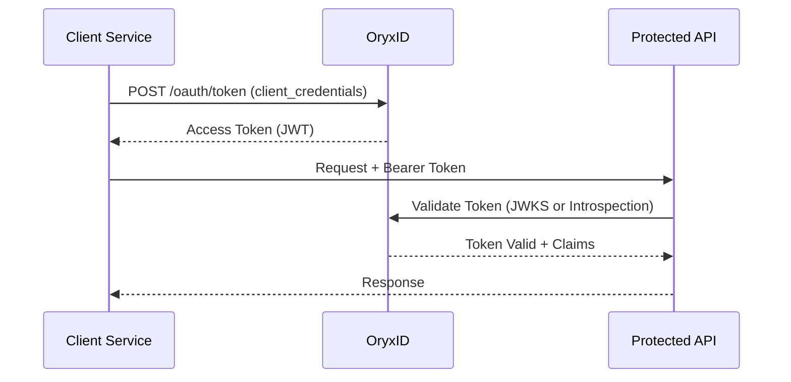

# Machine-to-Machine (M2M) Integration Guide

This guide explains how to secure internal APIs using OryxID with the Client Credentials grant flow.

## Overview



## Step 1: Create an Application

Create a confidential application in the OryxID admin panel:

1. Navigate to **Applications** > **New Application**
2. Set **Name**: e.g., "Billing Service"
3. Set **Client Type**: `confidential`
4. Enable **Grant Types**: `client_credentials`
5. Assign **Scopes**: Select the scopes this service needs (e.g., `billing:read`, `billing:write`)
6. Save and copy the **Client ID** and **Client Secret**

## Step 2: Obtain Access Token

Request an access token using the Client Credentials grant:

```bash
curl -X POST https://auth.example.com/oauth/token \
  -u "CLIENT_ID:CLIENT_SECRET" \
  -d "grant_type=client_credentials" \
  -d "scope=billing:read billing:write"
```

Response:

```json
{
  "access_token": "eyJhbGciOiJSUzI1NiIsInR5cCI6IkpXVCIsImtpZCI6Ii4uLiJ9...",
  "token_type": "Bearer",
  "expires_in": 3600,
  "scope": "billing:read billing:write"
}
```

## Step 3: Integrate the SDK

### Go Integration

Install the SDK:

```go
import "github.com/tiiuae/oryxid/pkg/sdk"
```

#### Using Gin Middleware

```go
package main

import (
    "github.com/gin-gonic/gin"
    "github.com/tiiuae/oryxid/pkg/sdk"
)

func main() {
    // Initialize OryxID client
    client, err := sdk.New(sdk.Config{
        Issuer:    "https://auth.example.com",
        JWKSTTL:   5 * time.Minute,
    })
    if err != nil {
        log.Fatal(err)
    }

    // Create Gin middleware
    middleware := sdk.NewGinMiddleware(client)

    router := gin.Default()

    // Public endpoint
    router.GET("/public", func(c *gin.Context) {
        c.JSON(200, gin.H{"message": "public"})
    })

    // Protected endpoint - requires valid token
    router.GET("/protected", middleware.RequireAuth(), func(c *gin.Context) {
        claims := sdk.GetClaimsFromGin(c)
        c.JSON(200, gin.H{
            "message": "protected",
            "client":  claims.ClientID,
        })
    })

    // Protected endpoint - requires specific scope
    router.GET("/billing", middleware.RequireScope("billing:read"), func(c *gin.Context) {
        c.JSON(200, gin.H{"message": "billing data"})
    })

    // Protected endpoint - requires multiple scopes
    router.POST("/billing", middleware.RequireScope("billing:read", "billing:write"), func(c *gin.Context) {
        c.JSON(200, gin.H{"message": "billing updated"})
    })

    router.Run(":8080")
}
```

#### Using Standard HTTP Middleware

```go
package main

import (
    "net/http"
    "github.com/tiiuae/oryxid/pkg/sdk"
)

func main() {
    client, _ := sdk.New(sdk.Config{
        Issuer: "https://auth.example.com",
    })

    middleware := sdk.NewMiddleware(client)

    // Protected handler
    protected := middleware.RequireScope("api:read")(http.HandlerFunc(func(w http.ResponseWriter, r *http.Request) {
        claims := sdk.GetClaimsFromRequest(r)
        w.Write([]byte("Hello, " + claims.ClientID))
    }))

    http.Handle("/protected", protected)
    http.ListenAndServe(":8080", nil)
}
```

## Step 4: Scope Design

### Hierarchical Scopes

OryxID supports wildcard scopes for flexible access control:

| Scope Granted | Access |
|--------------|--------|
| `billing:*` | Grants all billing permissions |
| `billing:read` | Read-only billing access |
| `billing:write` | Write billing access |
| `*` | Full access (use with caution) |

### Recommended Patterns

```
{resource}:{action}

Examples:
- users:read
- users:write
- users:delete
- orders:read
- orders:create
- payments:process
```

### Checking Scopes in Code

```go
// Using ScopeChecker
sc := sdk.NewScopeChecker(claims.Scope)

if sc.Has("billing:read") {
    // Can read billing
}

if sc.HasAll("billing:read", "billing:write") {
    // Can read and write billing
}

if sc.HasAny("billing:read", "billing:admin") {
    // Can read or is admin
}
```

## Step 5: Token Validation Methods

### JWT Validation (Recommended)

The SDK validates JWTs locally using cached JWKS:

```go
client, _ := sdk.New(sdk.Config{
    Issuer:  "https://auth.example.com",
    JWKSTTL: 5 * time.Minute,  // Cache JWKS for 5 minutes
})

claims, err := client.ValidateJWT(token)
if err != nil {
    // Token invalid
}
```

### Token Introspection

For opaque tokens or additional validation:

```go
client, _ := sdk.New(sdk.Config{
    Issuer:       "https://auth.example.com",
    ClientID:     "my-service",
    ClientSecret: "secret",
})

response, err := client.Introspect(token)
if !response.Active {
    // Token not active
}
```

## Step 6: Error Handling

The middleware returns standard OAuth 2.0 error responses:

| Status | Error | Description |
|--------|-------|-------------|
| 401 | `invalid_token` | Token missing, expired, or invalid |
| 403 | `insufficient_scope` | Token doesn't have required scopes |

Example error response:

```json
{
  "error": "insufficient_scope",
  "error_description": "required scope: billing:write"
}
```

## Step 7: Monitoring

### Metrics

OryxID exposes Prometheus metrics at `/metrics`:

```
# Token issuance
oryxid_tokens_issued_total{client_id="billing-service",grant_type="client_credentials"} 1234

# Token validation latency
oryxid_token_validation_duration_milliseconds_bucket{le="10"} 890

# Failed authentications
oryxid_auth_failures_total{reason="client_credentials"} 5

# Rate limit violations
oryxid_rate_limit_violations_total{client_id="billing-service"} 2

# Active tokens
oryxid_active_tokens 456
```

### Health Checks

```bash
# Liveness probe
curl https://auth.example.com/health/live

# Readiness probe
curl https://auth.example.com/health/ready

# Detailed health
curl https://auth.example.com/health/detailed
```

## Best Practices

1. **Token Caching**: Cache access tokens until they expire minus a buffer (e.g., 5 minutes)

2. **Scope Principle of Least Privilege**: Request only the scopes the service actually needs

3. **Secret Rotation**: Rotate client secrets periodically using the admin API:
   ```bash
   curl -X POST https://auth.example.com/api/v1/applications/{id}/rotate-secret
   ```

4. **JWKS Caching**: The SDK caches JWKS automatically. Configure TTL based on security requirements

5. **Error Handling**: Always handle token validation errors gracefully and log for debugging

6. **Audit Logging**: OryxID logs all token issuance and revocation events for audit purposes

## Example: Complete Service

```go
package main

import (
    "log"
    "time"
    "github.com/gin-gonic/gin"
    "github.com/tiiuae/oryxid/pkg/sdk"
)

func main() {
    // Initialize SDK
    client, err := sdk.New(sdk.Config{
        Issuer:  "https://auth.example.com",
        JWKSTTL: 5 * time.Minute,
    })
    if err != nil {
        log.Fatal(err)
    }

    middleware := sdk.NewGinMiddleware(client)
    router := gin.Default()

    // API v1 - all endpoints require authentication
    api := router.Group("/api/v1")
    api.Use(middleware.RequireAuth())
    {
        // Read endpoints
        api.GET("/invoices", middleware.RequireScope("billing:read"), listInvoices)
        api.GET("/invoices/:id", middleware.RequireScope("billing:read"), getInvoice)

        // Write endpoints
        api.POST("/invoices", middleware.RequireScope("billing:write"), createInvoice)
        api.PUT("/invoices/:id", middleware.RequireScope("billing:write"), updateInvoice)

        // Admin endpoints
        api.DELETE("/invoices/:id", middleware.RequireScope("billing:admin"), deleteInvoice)
    }

    router.Run(":8080")
}

func listInvoices(c *gin.Context) {
    claims := sdk.GetClaimsFromGin(c)
    log.Printf("Client %s requested invoice list", claims.ClientID)
    c.JSON(200, gin.H{"invoices": []string{}})
}
// ... other handlers
```
