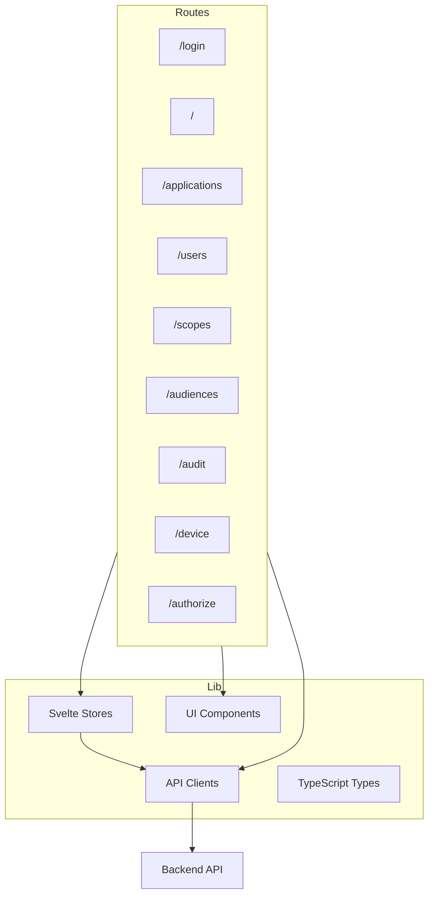
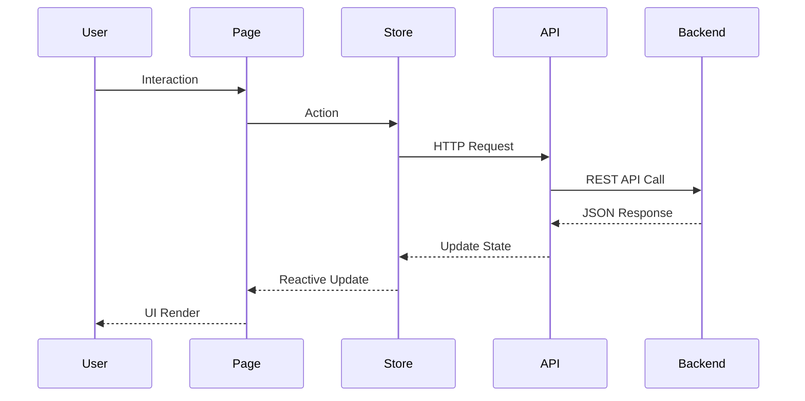
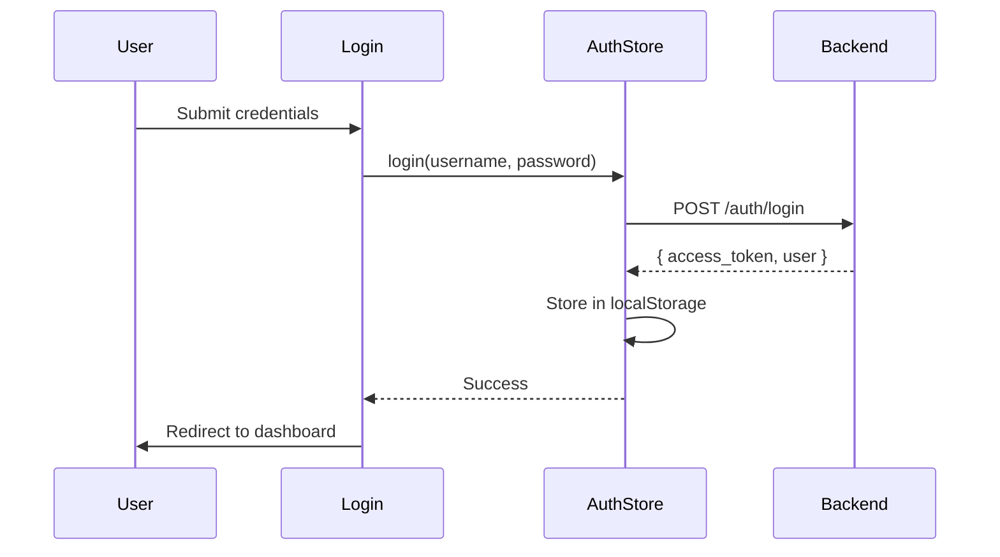
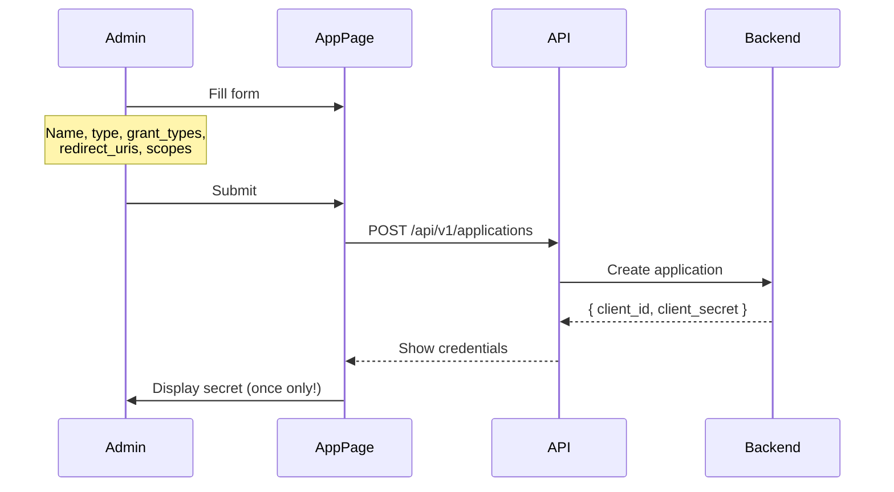
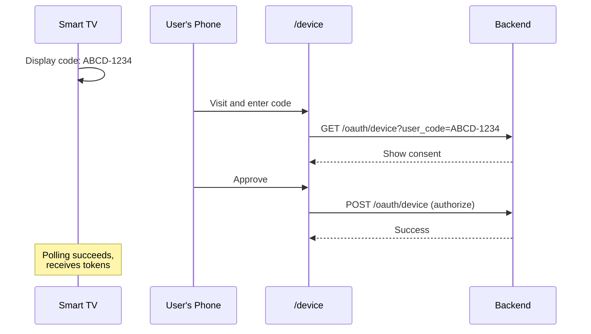

# OryxID Frontend

SvelteKit admin dashboard for OryxID OAuth2/OIDC server with comprehensive OAuth management.

For project overview, see [main README](../README.md).

## Structure



## Directory Layout

```text
src/
├── routes/              # SvelteKit pages
│   ├── +layout.svelte   # Root layout with sidebar
│   ├── +page.svelte     # Dashboard with statistics
│   ├── login/           # Admin login
│   ├── applications/    # OAuth application management
│   ├── users/           # User management
│   ├── scopes/          # Scope management
│   ├── audiences/       # Audience management
│   ├── audit/           # Audit log viewer
│   ├── device/          # Device authorization page (RFC 8628)
│   ├── authorize/       # OAuth consent page
│   └── health/          # Health check endpoint
├── lib/
│   ├── api/             # API client modules
│   │   ├── auth.ts      # Authentication API
│   │   ├── applications.ts
│   │   ├── users.ts
│   │   ├── scopes.ts
│   │   ├── audiences.ts
│   │   ├── audit.ts
│   │   └── stats.ts
│   ├── stores/          # Svelte stores
│   │   └── auth.ts      # Authentication state
│   ├── components/ui/   # Reusable UI components
│   ├── types/           # TypeScript type definitions
│   └── utils.ts         # Utility functions
└── tests/               # Test files
```

## Features

### Dashboard
Real-time statistics including:
- Active tokens count
- OAuth applications count
- User count
- Recent activity

### Application Management
Create and manage OAuth clients with support for:
- Client types: Confidential / Public
- Grant types:
  - Authorization Code
  - Client Credentials
  - Refresh Token
  - Device Authorization (RFC 8628)
  - Token Exchange (RFC 8693)
  - CIBA (Client-Initiated Backchannel Authentication)
  - Implicit (deprecated)
- Redirect URI management
- Scope assignment
- Skip authorization option (first-party apps)

### Device Authorization (RFC 8628)
User verification page at `/device` where users enter the device code displayed on limited-input devices.

### OAuth Consent
Authorization consent page at `/authorize` for user approval of third-party application access.

### Scope Management
Define custom OAuth scopes with:
- Scope name (following convention: `resource:action`)
- Description
- Default scope flag

### Audience Management
Configure resource server audiences for token validation.

### Audit Logs
View security audit events with filtering by:
- Action type
- User
- Date range

## Components

| Component | Description |
|-----------|-------------|
| Button | Primary, secondary, outline, destructive variants |
| Card | Container with optional header/footer |
| Input | Form input with validation |
| Label | Form labels |
| Badge | Status indicators |
| Select | Dropdown selection |
| Modal | Dialog overlay |

## API Clients

| Module | Description |
|--------|-------------|
| `auth.ts` | Login, logout, refresh, current user |
| `applications.ts` | CRUD operations for OAuth apps |
| `users.ts` | User management |
| `scopes.ts` | Scope management |
| `audiences.ts` | Audience management |
| `audit.ts` | Audit log queries |
| `stats.ts` | Dashboard statistics |

## Stores

| Store | Purpose |
|-------|---------|
| `auth` | Authentication state, token storage, user info |

## Development

### Prerequisites

- Node.js 20+
- npm 10+

### Local Development

```bash
# Install dependencies
npm install

# Start dev server (watches for changes)
npm run dev

# Or use make from project root
make dev-frontend
```

Access at http://localhost:3000

### Environment Variables

| Variable | Description | Default |
|----------|-------------|---------|
| `PUBLIC_API_URL` | Backend API URL | http://localhost:9000 |
| `ORIGIN` | Frontend origin for CORS | http://localhost:3000 |

## Testing

```bash
# Run tests in watch mode
npm test

# Run tests once
npm run test:unit

# Run with coverage
npm run coverage

# From project root
make test-frontend
```

### Test Files

| File | Description |
|------|-------------|
| `lib/api/client.test.ts` | API client tests |
| `lib/stores/auth.test.ts` | Auth store tests |
| `lib/utils.test.ts` | Utility function tests |
| `lib/components/ui/*.test.ts` | Component tests |

## Code Quality

```bash
# Type check
npm run check

# Lint (ESLint)
npm run lint

# Format (Prettier)
npm run format
```

## Build

```bash
# Production build
npm run build

# Preview production build
npm run preview
```

## Docker

### Development Mode

```bash
# From project root
docker compose up frontend
```

Frontend runs at http://localhost:3000 with hot reload.

### Production Mode

The frontend is served via nginx at http://localhost:8080.

```bash
make up
```

## Tech Stack

| Technology | Purpose |
|------------|---------|
| SvelteKit | Full-stack framework |
| TypeScript | Type safety |
| Tailwind CSS | Utility-first styling |
| Vite | Build tool |
| Vitest | Unit testing |
| bits-ui | UI primitives |
| lucide-svelte | Icons |
| zod | Schema validation |

## Data Flow



## Authentication Flow



## Application Creation Flow



## Device Authorization UI (RFC 8628)



## OAuth Grant Types UI

The application form supports these grant types:

| Grant Type | UI Label | Description |
|------------|----------|-------------|
| `authorization_code` | Authorization Code | Standard web app flow |
| `client_credentials` | Client Credentials | Server-to-server |
| `refresh_token` | Refresh Token | Token renewal |
| `urn:ietf:params:oauth:grant-type:device_code` | Device Authorization | Limited input devices |
| `urn:ietf:params:oauth:grant-type:token-exchange` | Token Exchange | Token delegation |
| `urn:openid:params:grant-type:ciba` | CIBA | Backchannel auth |
| `implicit` | Implicit | Deprecated, for legacy apps |

## Route Reference

| Route | Purpose | Auth Required |
|-------|---------|---------------|
| `/` | Dashboard | Yes |
| `/login` | Admin login | No |
| `/applications` | OAuth app management | Yes |
| `/users` | User management | Yes (Admin) |
| `/scopes` | Scope management | Yes |
| `/audiences` | Audience management | Yes |
| `/audit` | Audit logs | Yes (Admin) |
| `/device` | Device code entry | No |
| `/authorize` | OAuth consent | Session |
| `/health` | Health check | No |
