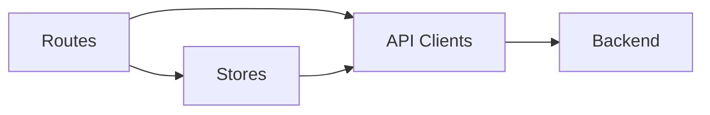
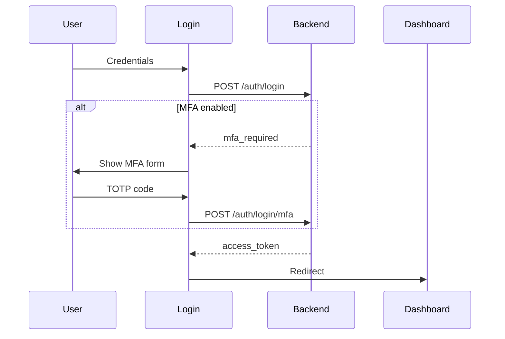

# Frontend

SvelteKit admin dashboard for OryxID. See [main README](../README.md) for project overview.

## Structure



## Routes

| Route | Purpose | Auth |
|-------|---------|------|
| `/` | Dashboard | Yes |
| `/login` | Admin login | No |
| `/applications` | OAuth app management | Yes |
| `/users` | User management | Admin |
| `/scopes` | Scope management | Yes |
| `/audiences` | Audience management | Yes |
| `/settings` | User settings, MFA | Yes |
| `/audit` | Audit logs | Admin |
| `/device` | Device code entry | No |
| `/authorize` | OAuth consent | Session |

## Development

### Prerequisites

- Node.js 20+
- npm 10+

### Run Locally

```bash
npm install
npm run dev
```

Access: http://localhost:3000

### Environment

| Variable | Default |
|----------|---------|
| `PUBLIC_API_URL` | http://localhost:9000 |
| `ORIGIN` | http://localhost:3000 |

## Commands

```bash
npm run dev       # Development server
npm run build     # Production build
npm run preview   # Preview build
npm run check     # Type check
npm run lint      # ESLint
npm run format    # Prettier
npm test          # Vitest
```

## Directory Layout

```
src/
├── routes/           # Pages
│   ├── +layout.svelte
│   ├── +page.svelte  # Dashboard
│   ├── login/
│   ├── applications/
│   ├── users/
│   ├── scopes/
│   ├── settings/     # MFA setup
│   ├── device/       # RFC 8628
│   └── authorize/    # OAuth consent
├── lib/
│   ├── api/          # API clients
│   ├── stores/       # Svelte stores
│   └── components/   # UI components
└── tests/
```

## API Clients

| Module | Purpose |
|--------|---------|
| `auth.ts` | Login, logout, MFA |
| `applications.ts` | OAuth apps CRUD |
| `users.ts` | User management |
| `scopes.ts` | Scope management |
| `settings.ts` | User settings |

## Auth Flow



## Tech Stack

| Technology | Purpose |
|------------|---------|
| SvelteKit | Framework |
| TypeScript | Type safety |
| Tailwind CSS | Styling |
| Vite | Build tool |
| Vitest | Testing |

## Testing

```bash
npm test              # Watch mode
npm run test:unit     # Single run
npm run coverage      # With coverage
```
