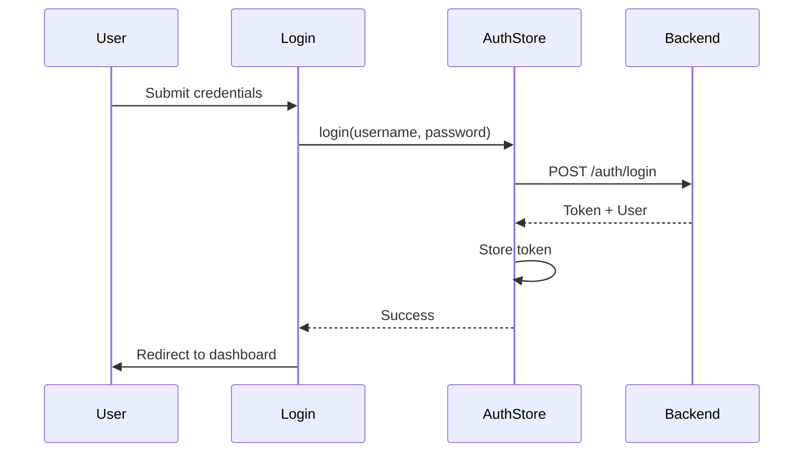

# OryxID Frontend

SvelteKit admin dashboard for OryxID OAuth2/OIDC server.

For project overview, see [main README](../README.md).

## Structure

```mermaid
graph TD
    subgraph Routes
        Login[/login]
        Dashboard[/]
        Apps[/applications]
        Users[/users]
        Scopes[/scopes]
        Audit[/audit]
        Settings[/settings]
    end

    subgraph Lib
        API[API Clients]
        Stores[Svelte Stores]
        Components[UI Components]
        Utils[Utilities]
    end

    Routes --> API
    Routes --> Stores
    Routes --> Components
    API --> Backend[Backend API]
    Stores --> API
```

## Directory Layout

```text
src/
├── routes/              # SvelteKit pages
│   ├── +layout.svelte   # Root layout
│   ├── +page.svelte     # Dashboard
│   ├── login/           # Login page
│   ├── applications/    # OAuth applications
│   ├── users/           # User management
│   ├── scopes/          # Scope management
│   ├── audit/           # Audit logs
│   ├── settings/        # Settings
│   └── health/          # Health endpoint
├── lib/
│   ├── api/             # API clients
│   ├── stores/          # Svelte stores
│   ├── components/ui/   # UI components
│   ├── types/           # TypeScript types
│   └── utils.ts         # Utilities
└── tests/               # Test setup
```

## Components

| Component | Description |
|-----------|-------------|
| Button | Primary, secondary, destructive variants |
| Card | Container with header/content/footer |
| Input | Form input with validation |
| Label | Form labels |
| Badge | Status indicators |

## API Clients

| Module | Description |
|--------|-------------|
| `auth.ts` | Authentication (login, logout, session) |
| `applications.ts` | OAuth application CRUD |
| `users.ts` | User management |
| `scopes.ts` | Scope management |
| `audit.ts` | Audit log queries |
| `stats.ts` | Dashboard statistics |

## Stores

| Store | Description |
|-------|-------------|
| `auth` | Authentication state, user info |

## Development

### Prerequisites

- Node.js 20+
- npm 10+

### Local Development

```bash
# Install dependencies
npm install

# Start dev server
npm run dev

# Or use make from root
make dev-frontend
```

### Environment Variables

| Variable | Description |
|----------|-------------|
| `PUBLIC_API_URL` | Backend API URL |
| `ORIGIN` | Frontend origin for CORS |

## Testing

```bash
# Run tests
npm test

# Run tests once
npm run test:unit

# From root
make test-frontend
```

### Test Files

| File | Description |
|------|-------------|
| `lib/api/client.test.ts` | API client tests |
| `lib/stores/auth.test.ts` | Auth store tests |
| `lib/utils.test.ts` | Utility tests |
| `lib/components/ui/*.test.ts` | Component tests |

## Code Quality

```bash
# Type check
npm run check

# Lint
npm run lint

# Format
npm run format
```

## Build

```bash
# Production build
npm run build

# Preview production build
npm run preview
```

## Docker

### Docker Development

```bash
# From root
docker compose up frontend
```

### Production

```bash
# Build and run all services
make up
```

## Tech Stack

| Technology | Purpose |
|------------|---------|
| SvelteKit | Framework |
| TypeScript | Type safety |
| Tailwind CSS | Styling |
| Vite | Build tool |
| Vitest | Testing |
| bits-ui | UI primitives |
| lucide-svelte | Icons |
| zod | Validation |

## Data Flow


## Authentication Flow



