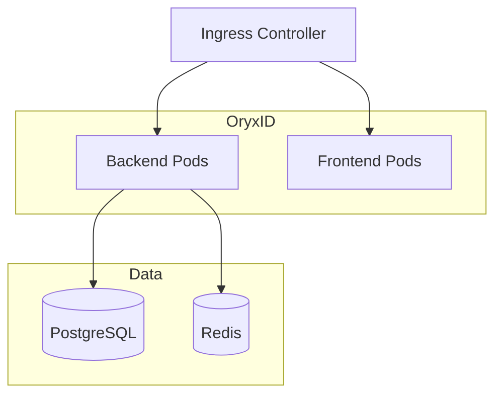

# Helm Chart

Kubernetes deployment for OryxID. See [main README](../../README.md) for project overview.

## Install

```bash
# Add dependencies
helm dependency update ./helm/oryxid

# Install
helm install oryxid ./helm/oryxid \
  --namespace oryxid \
  --create-namespace \
  --set admin.password=secure-password \
  --set ingress.hosts[0].host=auth.example.com
```

Or via make:

```bash
make helm-install
make helm-install-prod  # Production values
```

## Configuration

### Required

| Parameter | Description |
| ----------- | ------------- |
| `admin.password` | Admin user password |
| `ingress.hosts[0].host` | Domain name |
| `backend.oauth.issuer` | Token issuer URL |

### Images

| Parameter | Default |
| ----------- | --------- |
| `backend.image.repository` | oryxid/backend |
| `backend.image.tag` | latest |
| `frontend.image.repository` | oryxid/frontend |
| `frontend.image.tag` | latest |

### Replicas

| Parameter | Default |
| ----------- | --------- |
| `backend.replicaCount` | 2 |
| `frontend.replicaCount` | 2 |

### Database

Built-in PostgreSQL (Bitnami subchart):

| Parameter | Default |
| ----------- | --------- |
| `postgresql.enabled` | true |
| `postgresql.auth.username` | oryxid |
| `postgresql.auth.database` | oryxid |
| `postgresql.primary.persistence.size` | 10Gi |

External PostgreSQL:

```yaml
postgresql:
  enabled: false
externalDatabase:
  host: postgres-host
  port: 5432
  user: oryxid
  password: secret
  database: oryxid
```

### Redis

Built-in Redis (Bitnami subchart):

| Parameter | Default |
| ----------- | --------- |
| `redis.enabled` | true |
| `redis.auth.enabled` | true |
| `redis.master.persistence.size` | 2Gi |

### Ingress

| Parameter | Default |
| ----------- | --------- |
| `ingress.enabled` | true |
| `ingress.className` | nginx |
| `ingress.annotations` | cert-manager, ssl-redirect |
| `ingress.tls[0].secretName` | oryxid-tls |

## Production Values

Use `values-production.yaml` for production:

```bash
helm install oryxid ./helm/oryxid \
  -f ./helm/oryxid/values-production.yaml \
  --set admin.password=secure-password
```

Includes:

- 3 replicas with HPA
- Higher resource limits
- PodDisruptionBudget minAvailable: 2

## Architecture



## Commands

```bash
make helm-deps       # Update dependencies
make helm-lint       # Validate chart
make helm-template   # Render templates
make helm-install    # Install to cluster
make helm-uninstall  # Remove from cluster
make helm-status     # Show status
make k8s-pods        # List pods
make k8s-logs        # Tail logs
```

## Upgrade

```bash
helm upgrade oryxid ./helm/oryxid --namespace oryxid
```

## Uninstall

```bash
helm uninstall oryxid --namespace oryxid
```

Note: PVCs are retained. Delete manually if needed:

```bash
kubectl delete pvc -n oryxid -l app.kubernetes.io/instance=oryxid
```
